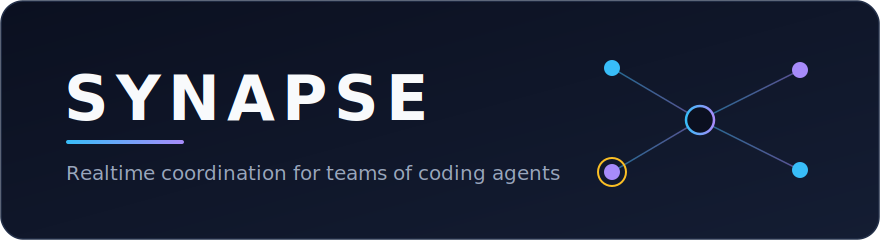
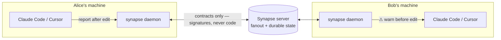

<div align="center">



[](LICENSE)
[](https://nodejs.org)
[](#roadmap)
[](#license)

</div>

> Agents still write the code. Synapse gives them current team context **before** they edit, then records contract-level changes **after** they edit, so other agents can avoid collisions.

---

## What it does

When several teammates each point a coding agent (Claude Code, Cursor, Copilot, Gemini…) at the same repo, they collide — two agents change the same function's signature in incompatible ways and nobody notices until merge. Synapse is a realtime layer that catches this the moment it matters: it warns an agent **before** it edits a symbol a teammate's agent just touched.

```text
⚠ Synapse: 1 potential conflict(s) before editing src/auth/token.ts
• [same_symbol_unpushed] alice has an unpushed change to validate (with alice)
  → coordinate before editing
```

- **Contract-level, not file-level** — compares real `before` → `after` signatures and classifies them _breaking / compatible / identical / divergent_, not just "same file touched."
- **Deterministic first** — detection is never the LLM. An optional [OpenRouter](https://openrouter.ai) layer only enriches analysis and resolution; it can raise, never downgrade, a verdict.
- **Any agent** — Claude Code via `PreToolUse` / `PostToolUse` hooks, every other agent via MCP, with the same check-before-edit / report-after-edit behavior.
- **Warns, never blocks** — agents query, humans decide. Synapse surfaces the conflict inline and gets out of the way.



Each daemon keeps your raw code local — only symbol-level contracts (signatures, never function bodies) ever cross the wire.

---

## Use it with your team

```bash
npm install -g @kumario/synapse   # installs the `synapse` binary
```

**Prerequisites:** Node.js 20.19.0+ and npm 11.4.1. Python 3.10+ and Go 1.22+ are optional — needed only to analyze `.py` / `.go` files; without them, those languages degrade gracefully to file-level detection.

Two machines coordinate when their daemons share the same `repoId` (auto-derived from the git remote) against the same server.

```bash
# Host — start the server, expose it over a public wss:// tunnel,
# write the URL into .synapse/team.json, and print the teammate command + token.
synapse up --serve --tunnel

# Teammate — commit .synapse/team.json, share the token out-of-band, then:
SYNAPSE_AUTH_TOKEN=<token> synapse up
```

Then **restart Claude Code** in the repo so it loads the freshly installed hooks, and run `synapse doctor` to confirm the room — it should list your teammate as a peer (resolved identity, server reachability, auth vs. unreachable, protocol version, live peers). Now when Alice's agent edits `validate`, Bob's agent sees the warning above before it touches the same symbol.

> **Want to see it first, solo?** Run `synapse demo` — it spins up a server and two daemons in a throwaway sandbox (own SQLite state, own free ports, a random `demo/<hex>` room — never your repo), narrates Alice changing a return type and Bob's next check catching the conflict, then tears everything down. Pass `--keep` to leave the sandbox on disk, or `--json` for a machine-readable result.

<details>
<summary><b>Watch a real conflict — the two-agent walkthrough</b></summary>

Use the team setup above to bring up the host (`synapse up --serve --tunnel`) and teammate (`SYNAPSE_AUTH_TOKEN=<token> synapse up`). Then **restart Claude Code** in the repo, confirm the room with `synapse doctor` (it should list the other person as a peer), and drive it **in order**:

- **Alice** asks her Claude: _"Edit `src/auth/token.ts` so `validate` returns `Token | null`."_ Let it **save** — the PostToolUse hook reports the delta.
- **Bob** asks his Claude: _"Edit `src/auth/token.ts` so `validate` returns `Promise<boolean>`."_ Before it writes, Bob's PreToolUse hook surfaces _"⚠ Synapse: alice has an unpushed change to `validate` — coordinate before editing,"_ and Claude asks Bob how to proceed.

**Gotchas — why a demo can look like nothing happened**

1. **Share a real token.** `--tunnel` requires auth; without `SYNAPSE_AUTH_TOKEN` a random token is generated and printed only once. Pass your own so the teammate can join. `synapse doctor` shows `token=unset → 401` when this is wrong.
2. **Different sessions only.** A session never warns about its _own_ change — editing twice from one machine/session shows nothing.
3. **Order matters.** The editor must **save first** (PostToolUse reports) before the other agent's PreToolUse check can see it.
4. **Restart Claude Code** after `synapse up` so it loads the freshly installed hooks. Don't commit `.claude/settings.json` — the hook path is machine-specific; each person's `synapse up` writes their own.

</details>

<details>
<summary><b>Local dry-run — two agents, one machine</b></summary>

Two daemons against one local server, driven by the CLI. Proves the whole detect loop.

```bash
# 1. A throwaway project with a symbol to fight over
mkdir -p /tmp/synapse-demo/src && cd /tmp/synapse-demo && git init -q
printf 'export function area(w: number, h: number): number {\n  return w * h;\n}\n' > src/widget.ts
git add -A && git -c user.email=demo@local -c user.name=demo commit -qm init

# 2. Terminal 1 — server + Alice's daemon
synapse up --serve --member alice --session alice --port 4011 --repo-id demo/playground

# 3. Terminal 2 — Bob's daemon against the same server
synapse daemon --member bob --session bob --port 4012 --server ws://localhost:4010 --repo-id demo/playground

# 4. Terminal 3 — Alice records a change, Bob checks the same symbol first
synapse report --port 4011 --file src/widget.ts --symbol ts:src/widget.ts#area --summary "area() now takes a Rect"
synapse check  --port 4012 --file src/widget.ts --symbol ts:src/widget.ts#area
#  → verdict: "warn", rule: "same_symbol_unpushed", counterpart: "alice"
synapse whatsup --port 4012
```

</details>

<details>
<summary><b>Network &amp; filesystem safety</b></summary>

By default, local Synapse daemons and servers bind only to loopback (`127.0.0.1`). Set `SYNAPSE_DAEMON_HOST` or `SYNAPSE_SERVER_HOST` explicitly when you intentionally need a LAN/public listener, for example `SYNAPSE_SERVER_HOST=0.0.0.0` in a container or VM.

All local file arguments are resolved inside the configured `worktreeRoot`. Absolute paths, `..` traversal, and symlink escapes are rejected before the daemon reads a file or hands it to an analyzer.

</details>

---

<details>
<summary><h2 style="display:inline">How it works</h2></summary>

```text
apps/
  cli/          local daemon, CLI commands, and MCP stdio adapter
  server/       websocket fanout server + durable StateStore (SQLite)
packages/
  analyzer-ts/      TypeScript contract extraction
  analyzer-py/      Python contract extraction + dependency graph
  analyzer-go/      Go contract extraction + dependency graph (go/parser sidecar)
                    (tree-sitter + jedi sidecar over JSON-RPC/stdio)
  protocol/         shared wire, state, and symbol types
  conflict-engine/  pure conflict evaluator
```

The server is single-process with an in-memory hot path backed by a durable store. The daemon keeps raw code local. Detection is deterministic; humans decide — Synapse warns inline, never auto-blocks.

### Deterministic vs. optional LLM (OpenRouter)

| Layer               | Without a key                                                               | With `OPENROUTER_API_KEY`                                                   |
| ------------------- | --------------------------------------------------------------------------- | --------------------------------------------------------------------------- |
| Detection           | Fully deterministic                                                         | Unchanged (never affected)                                                  |
| Analysis            | Structured before→after verdict                                             | Task-aware prose; can raise but not downgrade a verdict                     |
| Contract resolver   | `contract_divergent` → escalate; `same_symbol_unpushed` → adopt counterpart | Synthesizes one merged contract (must parse via the real analyzer)          |
| Mediator resolution | Deterministic proposal class/status/signatures/call-sites                   | Same proposal semantics; optional LLM-authored `adapt` prose when resolving |
| Session summary     | Structured list of changes                                                  | 2–3 prose sentences                                                         |

Set the key in `.env` (see `.env.example`). Model defaults to `anthropic/claude-haiku-4.5`, overridable via `SYNAPSE_LLM_MODEL`. Disable layers independently with `SYNAPSE_LLM_EXPLAIN=0`, `SYNAPSE_LLM_RESOLVE=0` (contract resolver and mediator adapt prose), `SYNAPSE_LLM_SUMMARY=0`.

An analysis's `actions[]` may carry a `command` suggesting a Synapse tool to call next (e.g. `synapse_whatsup`, `synapse_why`), rendered as `→ run: ...` in the Claude Code hook output. The deterministic floor attaches these for its own rule-appropriate suggestions even without a key; with a key, the model may also suggest one, validated against the same fixed allowlist (`packages/protocol/src/command-catalog.ts`) — an unknown tool is dropped but the step text is kept. Set `SYNAPSE_LLM_COMMANDS=0` to drop the command catalog from the LLM prompt (the allowlist check still runs).

### Resolution mediator (preview)

When two live agents contest the same symbol, Synapse classifies the collision deterministically. A **mechanical** conflict means one side changed the contract, or both sides reported identical resulting signatures; Synapse creates the existing suggest-only `keep`/`adapt` proposal, delivered in `state.snapshot`, and it becomes `resolved` only after both agents accept with `resolution.ack`. A **semantic** conflict means both sides reported mutually exclusive signatures; Synapse does **not** fabricate a merged `after`. It broadcasts an `awaiting_owner` proposal with the two candidate session IDs, and the Owner chooses the winner through `POST /auth/projects/resolve-winner?repoId=<id>&proposalId=<id>&winnerSessionId=<id>`, cookie-authed and authorized by Project ownership. After the Owner picks, the winner keeps its signature and the other side gets the deterministic `adapt` call-site list, then the normal accept/reject/timeout flow applies. When configured, the mediator LLM may rephrase only the losing side's `adapt` guidance; it cannot choose winners, change `after`, alter detection verdicts, change proposal status, or edit code. A reject from either agent, or a TTL timeout while resolving, voids the coordinated pair (`status: "voided"` with `voidReason: "rejected"` or `"timeout"`); the TTL is `SYNAPSE_RESOLUTION_TTL_MS` (default 5 minutes) and starts only after a proposal is `resolving`. See [ADR-0002](docs/adr/0002-llm-resolution-mediator-suggest-only.md).

</details>

<details>
<summary><h2 style="display:inline">All commands</h2></summary>

The CLI binary is `synapse` (`apps/cli/src/index.ts`). In a dev checkout, run any command via `npm run dev --workspace @synapse/cli -- <command>`.

| Command    | Description                                                                                         |
| ---------- | --------------------------------------------------------------------------------------------------- |
| `daemon`   | Start the local daemon                                                                              |
| `check`    | Call the local `synapse_check` endpoint                                                             |
| `report`   | Call the local `synapse_report` endpoint                                                            |
| `push`     | Notify Synapse that files were pushed                                                               |
| `feedback` | Record acted/dismissed feedback for a conflict warning                                              |
| `insights` | Show local aggregate coordination insights, including mediator proposal counts                       |
| `session`  | Start, heartbeat, or end a local session                                                            |
| `whatsup`  | Show the daemon's current team-state briefing                                                       |
| `why`      | Search Synapse memory with source citations                                                         |
| `pr-brief` | Local PR handoff briefing for a base/head branch pair                                               |
| `mcp`      | Run a stdio MCP server exposing Synapse tools plus read-only context resources                      |
| `connect`  | Wire other agents (Cursor, VS Code/Copilot, Gemini CLI, Windsurf, any MCP client) to the MCP server |
| `join`     | Write `.synapse/config.json`, install Claude Code hooks, and `connect` other agents                 |
| `up`       | join + preflight + start daemon (`--serve` / `--tunnel` for the host)                               |
| `keygen`   | Mint a project-scoped key for this repo (needs `SYNAPSE_MASTER_SECRET`)                             |
| `doctor`   | Preflight: identity, server reachability, auth, and live peers                                      |
| `hook`     | Claude Code hook entrypoint (`pre`\|`post`); reads hook JSON on stdin                               |
| `analyze`  | Extract TypeScript contract symbols from a file                                                     |
| `help`     | Print usage and examples                                                                            |

</details>

<details>
<summary><h2 style="display:inline">Works with any agent (MCP)</h2></summary>

Claude Code gets `PreToolUse` / `PostToolUse` / `SessionStart` hooks that fire `synapse_check` before edits, `synapse_report` after edits, and a `synapse_whatsup` catch-up at session start. A file-based pre-check records the current contract snapshot locally, so the first post-edit report can emit the real before -> after delta without requiring a separate baseline call. Every other agent gets the **same behavior** through MCP — `synapse join` (and `synapse connect`) sets it up automatically:

```bash
synapse connect                        # wire up every supported agent
synapse connect --agent cursor,vscode  # or just the ones you use
```

This does three things so other agents connect seamlessly and then use Synapse the way it's intended:

1. **Registers the stdio MCP server** in each client's own config — `.cursor/mcp.json`, `.vscode/mcp.json`, `.gemini/settings.json`, and the cross-agent `.mcp.json` — pointing at `synapse mcp`. The adapter resolves its room (repoId, session, daemon port) from `.synapse/config.json`, so there is nothing else to configure.
2. **Exposes MCP resources for passive context** — `synapse://briefing`, `synapse://team-state`, `synapse://decisions`, and `synapse://pr-brief` — so clients can list/read the current team digest, cited memories, and PR handoff context without making a tool call. Tools remain the action surface for checks, reports, pushes, feedback, aggregate insights, PR briefings, and argument-specific memory searches.
3. **Drops rules files that encode the hooks as instructions** — `AGENTS.md`, `.cursor/rules/synapse.mdc`, and `.windsurf/rules/synapse.md` — telling the agent to read context resources when available, call `synapse_check` before editing, `synapse_report` after, and use `synapse_whatsup` as the fallback session-start catch-up. The MCP server also advertises the same guidance via the protocol-native `instructions` field, so even clients that ignore rules files still receive it. The generated command reference comes from `packages/protocol/src/command-catalog.ts`, the same catalog that grounds deterministic and optional-LLM action suggestions.

Every write is idempotent and preserves your existing content (managed blocks for markdown, key-merge for JSON), so it is safe to re-run.

</details>

<details>
<summary><h2 style="display:inline">Self-hosting &amp; auth</h2></summary>

### Server auth modes

Resolved at server startup. `/health` and the GitHub webhook (its own HMAC) stay open; credentials are sent via `?token=` / `Authorization: Bearer` and compared in constant time — never written to disk.

| Mode             | Trigger                 | Behavior                                                                                                                       |
| ---------------- | ----------------------- | ------------------------------------------------------------------------------------------------------------------------------ |
| **open**         | neither var set         | No auth — keeps local/dev and verify scripts hermetic                                                                          |
| **shared-token** | `SYNAPSE_AUTH_TOKEN`    | Any valid token reads/writes any project                                                                                       |
| **project-key**  | `SYNAPSE_MASTER_SECRET` | Real tenancy: key = `base64url(HMAC-SHA256(secret, repoId))`, authorizes only its project (checked at handshake + per-message) |

### GitHub App setup

For hosted Synapse, register a GitHub App and set `SYNAPSE_GITHUB_APP_ID`, `SYNAPSE_GITHUB_APP_CLIENT_ID`, `SYNAPSE_GITHUB_APP_CLIENT_SECRET`, `SYNAPSE_GITHUB_APP_PRIVATE_KEY`, and `SYNAPSE_GITHUB_WEBHOOK_SECRET` on the server.

GitHub console settings:

- User authorization callback URL: `https://<host>/auth/github/callback`
- Setup/installation callback URL: `https://<host>/auth/github/setup`
- Webhook URL: `https://<host>/webhooks/github`
- Webhook secret: the same value as `SYNAPSE_GITHUB_WEBHOOK_SECRET`
- Repository permissions: Contents read-only, Metadata read-only, Pull requests read-only
- Subscribe to events: Push, Pull request, Pull request review, Issue comment

Sign-in and repo-claiming (below) are both live. For claiming, enable **"Request user authorization (OAuth) during installation"** on the App so the setup callback carries an OAuth `code`, and set the optional `SYNAPSE_GITHUB_APP_SLUG` (the App's URL slug) so the server can build the install URL. Setting only `SYNAPSE_GITHUB_WEBHOOK_SECRET` remains valid for signed webhooks without the full App auth flow.

Credentials are sent via `Authorization: Bearer` (the server still accepts `?token=` for back-compat), keeping tokens out of URL query strings and access logs.

### Sign in with GitHub

The first **human** trust boundary. Active only when the GitHub App env above is fully `configured` (visible as `githubApp: "configured"` on `/health`); otherwise the routes 404 and the web app stays signed-out. Four same-origin routes:

| Route                       | Purpose                                                                                                      |
| --------------------------- | ------------------------------------------------------------------------------------------------------------ |
| `GET /auth/github`          | Start the user-to-server OAuth flow (sets a short-lived signed `state` cookie for CSRF, redirects to GitHub) |
| `GET /auth/github/callback` | Exchange the code, upsert the Owner on first login, set the session cookie, redirect to `/`                  |
| `GET /auth/me`              | Return the signed-in Owner (`{ owner: { login, name, avatarUrl } }`) or `401`                                |
| `POST /auth/logout`         | Clear the session cookie (`GET` accepted too)                                                                |

The session is a **stateless signed cookie** (`synapse_session`, `HttpOnly; SameSite=Lax`, 30-day HMAC; `Secure` when the public origin is https) — no sessions table, so sign-out just clears the cookie. The HMAC key is **derived from the OAuth client secret**, so no extra env var is needed. Set `SYNAPSE_PUBLIC_URL` (optional) to build the OAuth `redirect_uri`; it defaults to `http://<host>:<port>`.

This cookie session is **identity only** — it is never a daemon credential and never authorizes a WS room or `/state`, which keep using the separate machine `project-key`/`shared-token` path. A small `users` table (same backend selection as the state store) holds Owner identity; the GitHub user access token is not persisted.

### Claim a Project

Turns a signed-in Owner into the **Owner of a Project**. Claiming runs the Owner through the GitHub App installation flow for a repo they can push to, then records ownership and mints that repo's `project-key`. It needs `SYNAPSE_MASTER_SECRET` set (for the key) and `SYNAPSE_GITHUB_APP_SLUG` set (for the install URL); absent either, `/auth/projects/add` returns `503 claiming_unavailable`.

| Route                    | Purpose                                                                                                                                                                         |
| ------------------------ | ------------------------------------------------------------------------------------------------------------------------------------------------------------------------------- |
| `GET /auth/projects/add` | Start the claim: redirect the Owner to the App install page (`/apps/<slug>/installations/new`) with a short-lived signed `state` cookie                                         |
| `GET /auth/github/setup` | Install setup callback: verify session + state, exchange the OAuth `code` for the user access token, list the installation's repos, and claim each one the user can **push** to |
| `GET /auth/projects`     | Return the Owner's own claimed projects (`{ projects: [{ repoId, projectKey }] }`)                                                                                              |

The setup callback requires **"Request user authorization during installation"** enabled on the App, so it carries an OAuth `code`; if that setting is off, the `code` is absent and setup returns `400 missing_installation`. The user access token is used once (to list the installation's repositories) and then discarded — never persisted. Repos the Owner cannot push to are never claimed.

The `project-key` is minted via `deriveProjectKey(SYNAPSE_MASTER_SECRET, repoId)` and is **idempotent per `(owner, repo)`**: re-installing keeps the original key, so a running daemon's credential never changes. This key IS the per-repo daemon credential and is returned only to the authenticated Owner who claimed it (via `GET /auth/projects`); the cookie session never acts as a daemon credential. Installing the App also makes the repo's webhooks **live automatically** — GitHub delivers push/PR/review to the existing `POST /webhooks/github`, so no new webhook wiring is needed.

#### Connect a daemon (onboarding)

After claiming, the dashboard shows a per-Project onboarding panel that walks the Owner to a live daemon. It lists two steps: install the CLI with `npm install -g @kumario/synapse`, then start the daemon for that Project with `SYNAPSE_PROJECT_KEY=<key> synapse up --server <wss-url> --repo-id <repoId>`. The `<key>` is the same `project-key` minted at claim time — shown only to the owning Owner — and the `<wss-url>` is this hosted server's origin (`https`→`wss`). Each card polls the Room (`GET /state?repoId=&token=<project-key>`, the Owner's per-repo credential, not the cookie session) and flips its badge to **Connected** once a daemon joins. Dev-parity caveat: the panel is same-origin only — plain `vite dev` has no proxy to `/auth/projects`, so it stays signed-out (hidden) there, matching the rest of the auth surface.

#### Owner dashboard

A signed-in Owner sees a **Your Projects** panel listing every Project they have claimed, selects one, and watches its live Room — agent sessions, edit locks, contested symbols, mediator proposals, and the ship trail — reusing the same dashboard panels as the demo. The read is served by `GET /auth/projects/state?repoId=<id>`, which is **cookie-authed and authorized by ownership**: it returns `401` without a session, `403` for a repo the Owner has not claimed (ownership is checked via the project store, never via a token), and `400` without a `repoId`. This boundary is **distinct from the machine `GET /state` (`project-key`)** path — the two read paths stay separate. Live updates here are delivered by **polling** this cookie-authed route (~2s); the daemon's `project-key` WebSocket path is unchanged, and the WS handshake never accepts the cookie. Same-origin only, like the rest of the auth surface.

The Room dashboard's **Resolution mediator** card shows `resolving`, `resolved`, and escalated proposals (`awaiting_owner` or `voided`). Awaiting-owner semantic conflicts expose winner-choice buttons that call the existing cookie-authed `POST /auth/projects/resolve-winner` route; the dashboard never edits code or sends daemon WebSocket commands.

**Kick a Session** — an Owner can force-end a runaway or stale agent Session in a Project they own via `POST /auth/projects/kick?repoId=<id>&sessionId=<id>`. It is **cookie-authed and authorized by ownership** (the same project-store check as the read above): `401` without a session, `403` for a repo the Owner has not claimed, `400` without `repoId`/`sessionId`. The kick ends the Session (`status: ended`), releases its edit locks, closes its socket, and broadcasts the new Room state; a reconnecting daemon returns as a **fresh Session** — kick is an interrupt, not a ban (there is deliberately no blocklist). This is **HTTP only** — the kick is never a browser WebSocket message on the machine protocol; the browser stays off the daemon wire entirely.

**State store** — persisted per entity (sessions, locks, deltas, pushes, events, resolutions, summaries, feedback as rows; every mutation writes only its own row). Backend selection: `SYNAPSE_DATABASE_URL` → Postgres (the shared-database backend for multi-instance deployments; the `pg` driver loads only when selected); else `SYNAPSE_DB_PATH` → file-backed SQLite (WAL) that survives restarts; neither → ephemeral in-memory SQLite. Pre-existing SQLite snapshot databases migrate to per-entity rows automatically on first boot. Postgres schema initialization is serialized with advisory locks, and startup always attempts to release the lock before returning the pooled connection, including when DDL fails.

**Multi-instance** — set `SYNAPSE_REDIS_URL` (alongside a shared `SYNAPSE_DATABASE_URL`) to run several server instances behind a load balancer: after a mutation, the instance publishes the repo's Redis channel; the others re-read that repo from the shared store and re-broadcast the fresh snapshot to their local rooms. Redis carries no state — it is purely the wake-up signal (the `redis` driver loads only when selected), and lock/session expiry stays timestamp-based against the shared rows, so every instance evaluates the same liveness. Unset → the single-instance path, unchanged.

</details>

<details>
<summary><h2 style="display:inline">Reliability &amp; operations</h2></summary>

| Capability                 | Summary                                                                                                                                                                                                                                                                                                                                                                                                                                                                                                                                             |
| -------------------------- | --------------------------------------------------------------------------------------------------------------------------------------------------------------------------------------------------------------------------------------------------------------------------------------------------------------------------------------------------------------------------------------------------------------------------------------------------------------------------------------------------------------------------------------------------- |
| **Resilient channel**      | Exponential backoff + full jitter (`SYNAPSE_RECONNECT_BASE_MS` / `SYNAPSE_RECONNECT_MAX_MS`), capped offline outbox flushed in order on reconnect, and 20s server pings (`SYNAPSE_WS_PING_INTERVAL_MS`) that terminate half-open sockets                                                                                                                                                                                                                                                                                                            |
| **Observability**          | JSON logs gated by `SYNAPSE_LOG_LEVEL` (default `info`) + Prometheus counters at `GET /metrics`                                                                                                                                                                                                                                                                                                                                                                                                                                                     |
| **Ingress validation**     | Every server-bound wire message is validated against shared zod schemas before any state mutation, and daemon-bound server frames are validated before they update the warm cache. WS/webhook bodies and local daemon JSON tool bodies are capped at 1MB; malformed local JSON returns 400 and oversized local JSON returns 413                                                                                                                                                                                                                     |
| **Rate limiting**          | Per-connection WS budget (`SYNAPSE_RATE_LIMIT_PER_MIN`, default 600) and a webhook budget (`SYNAPSE_WEBHOOK_RATE_LIMIT_PER_MIN`, default 120): over-limit messages are acked `rate_limited` and dropped before any mutation; webhooks answer 429. `0` disables                                                                                                                                                                                                                                                                                      |
| **Webhook posture**        | A server running with auth (shared token or project keys) refuses unsigned webhooks with 403 until `SYNAPSE_GITHUB_WEBHOOK_SECRET` is set; open mode (local/dev) is unchanged                                                                                                                                                                                                                                                                                                                                                                       |
| **Protocol negotiation**   | Versions are exchanged at the WS handshake: legacy clients (no announcement) connect as v1, newer clients downgrade to the server's dialect, out-of-range clients are refused with HTTP 426 + the supported range in headers. Protocol v2 sockets receive incremental `state.delta` frames after mutations; v1 sockets continue to receive snapshots. `/health` reports `protocolVersion` + `minProtocolVersion`; `synapse doctor` fails loudly on non-overlapping ranges                                                                           |
| **Adaptive severity**      | `synapse_feedback` telemetry demotes a noisy rule (≥5 dismissals, ≥80% dismiss rate) from `warn` to `info`; detection never changes. Opt out with `SYNAPSE_ADAPTIVE_SEVERITY=0`                                                                                                                                                                                                                                                                                                                                                                     |
| **Branch-aware severity**  | Cross-branch `dependency_changed`/`stale_base` conflicts demote `warn` → `info` (they bite at merge time, not on the next keystroke); merge-blocking rules (`same_symbol_*`, `contract_divergent`) never demote. Sessions/pushes carry their git branch (webhook pushes derive it from `ref`), refreshed on every heartbeat so a mid-session checkout propagates within ~30s; unknown branch → no change. Opt out with `SYNAPSE_BRANCH_AWARE_SEVERITY=0`                                                                                            |
| **File watcher**           | The daemon watches the worktree (same ignore set as the analyzer scan), so manual edits — no agent, no `synapse_report` — still emit contract deltas through the report path. Debounced per file (`SYNAPSE_WATCH_DEBOUNCE_MS`, default 400ms); only analyzable sources are reported. While the watcher is active, warm pre-edit checks reuse the cached dependency graph instead of re-scanning the source tree (any report or watched change invalidates it; `synapse_graph_cache_hits_total` counts reuse). Opt out with `SYNAPSE_FILE_WATCHER=0` |
| **GitHub webhook binding** | Signed webhook events are bound to the payload's `repository.full_name`; local verifier overrides must use the same repo identity as the signed payload instead of remapping arbitrary repository names                                                                                                                                                                                                                                                                                                                                             |

**RAG memory** — with `SYNAPSE_DATABASE_URL` (Postgres + pgvector) and an OpenAI-compatible embeddings endpoint (`SYNAPSE_EMBED_BASE_URL`), the server indexes session summaries, contract resolutions, and repo events as vectors, and `synapse_why` answers **hybrid**: the deterministic lexical floor always stands, vector recall only adds semantically-related memories on top (`rag: true`, numbered citations preserved). pgvector extension/table initialization uses the same advisory-lock discipline as the state store and degrades cleanly if setup fails. Without embeddings, `/recall` reports `degraded: true` and the floor answers alone. Only prose is embedded — titles, summaries, rationales, and distilled PR/issue comment excerpts (code blocks stripped, capped at 500 chars; raw bodies are never persisted) — never raw code. `SYNAPSE_RAG=0` disables.

**Privacy** — detection is fully deterministic and local: only symbol-level contracts (signatures, never function bodies) leave the daemon. The older CLI contract _resolver_ sends the computing agent's full file plus its dependency-graph neighbors to the configured model so the merge is caller-aware. Mediator adapt prose is narrower: the server sends only deterministic proposal metadata such as symbol id, before/after signatures, summaries, session ids, and affected call-site paths. Opt out of both resolver and mediator adapt prose with `SYNAPSE_LLM_RESOLVE=0` (or leave `OPENROUTER_API_KEY` unset), or point `OPENROUTER_BASE_URL` at a local/self-hosted OpenAI-compatible endpoint to keep code on your machines.

**Install as a package** — the CLI ships as a single self-contained npm package (all five workspace packages, the server, and the Python/Go sidecar assets bundled):

```bash
npm install -g @kumario/synapse   # installs the `synapse` binary
```

To build the same tarball from a checkout (release flow):

```bash
node scripts/build-package.mjs    # stages + packs dist-release/<name>-<version>.tgz
npm run verify:package            # installs from the tarball and smoke-tests it
npm run verify:npm-pack           # compatibility alias for verify:package
npm publish --access public dist-release/<tarball>   # maintainers only
```

The public name/version live in [`release.config.json`](release.config.json); bump the version there before building, and keep it ahead of `npm view @kumario/synapse version`.

**CI** — `.github/workflows/ci.yml` runs build + typecheck + test plus the full hermetic verify matrix:

```bash
npm run verify:all                                       # one build, then every verify
node scripts/ci-verify-all.mjs --only why,doctor         # a subset while iterating
SYNAPSE_VERIFY_SKIP=hot-path-latency npm run verify:all  # explicit skips
```

</details>

<details>
<summary><h2 style="display:inline">Detection quality</h2></summary>

`npm run eval:detection` measures the seven conflict-engine rules
(`same_symbol_active`, `same_symbol_unpushed`, `contract_divergent`,
`dependency_changed`, `transitive_dependency`, `stale_base`,
`same_file_no_overlap`) against a corpus of 25 scenarios in
`evals/detection-corpus/` — both synthetic team-state scenarios and real
TypeScript source run through `extractTypeScriptContracts` →
`diffTypeScriptContracts` → `evaluateConflicts`. Per-rule precision/recall is
compared against the committed ratchet baseline in
`evals/detection-baseline.json`; the script exits non-zero on any regression,
on a new rule appearing without a baseline entry, or on a baseline rule
disappearing from the run. Metrics only move via a deliberate
`node scripts/eval-detection.mjs --write-baseline` run.

Snapshot from the committed baseline (regenerate with `--write-baseline` after
deliberately growing the corpus):

| Rule                    | TP  | FP  | FN  | Precision | Recall |
| ----------------------- | --- | --- | --- | --------- | ------ |
| `contract_divergent`    | 1   | 0   | 0   | 1.000     | 1.000  |
| `dependency_changed`    | 5   | 1   | 0   | 0.833     | 1.000  |
| `same_file_no_overlap`  | 1   | 0   | 0   | 1.000     | 1.000  |
| `same_symbol_active`    | 1   | 0   | 0   | 1.000     | 1.000  |
| `same_symbol_unpushed`  | 6   | 0   | 0   | 1.000     | 1.000  |
| `stale_base`            | 1   | 0   | 0   | 1.000     | 1.000  |
| `transitive_dependency` | 1   | 0   | 0   | 1.000     | 1.000  |

The one sub-1.0 metric is a known precision gap, not a corpus artifact: the
`dependency_changed` rule fires whenever a direct (1-hop) dependency changes,
**regardless of whether `compareSignatures` classifies the change as
compatible**. The `dependency_changed_but_compatible` scenario in
`evals/detection-corpus/dependency.json` encodes a teammate adding an optional
parameter to a function another module depends on — a backward-compatible
change — and the engine still flags `dependency_changed`. This is baselined
as the true number rather than hidden; fixing it (e.g. demoting
`dependency_changed` to `info` when `compareSignatures` says `compatible`) is
a candidate follow-up for `packages/conflict-engine/src/index.ts`, out of
scope for this benchmark.

</details>

<details>
<summary><h2 style="display:inline">Verification scripts</h2></summary>

Run with `npm run <script>`. See [`package.json`](package.json) for the complete list.

| Script                                                                          | Verifies                                                                                                                                                                                                                                               |
| ------------------------------------------------------------------------------- | ------------------------------------------------------------------------------------------------------------------------------------------------------------------------------------------------------------------------------------------------------ |
| `verify:m0`                                                                     | Runnable skeleton + realtime stub loop (milestone 0)                                                                                                                                                                                                   |
| `verify:analyzer-ts` / `verify:analyzer-py`                                     | Per-language contract extraction, signature diffing, and TS import-edge coverage                                                                                                                                                                       |
| `verify:python-check`                                                           | Full realtime Python loop → `contract_divergent` + resolution                                                                                                                                                                                          |
| `verify:analyzer-go` / `verify:go-check`                                        | Go contract extraction/diff (warm `go/parser` sidecar); full realtime Go loop → `contract_divergent` + resolution. Skips only when no Go toolchain is available; fails if Go is installed but the sidecar cannot build                                 |
| `verify:daemon-ts-report` / `verify:file-only-ts-check`                         | Automatic TS report path; symbol-level conflicts from a file path                                                                                                                                                                                      |
| `verify:dependency-ts-check`                                                    | Warns when a file depends on another's unpushed change through TS dependency edges                                                                                                                                                                     |
| `verify:tsx-check`                                                              | React-shaped repos: default-exported `.tsx` component props change → symbol delta + `dependency_changed` for the importing component; `.mjs` modules join the same graph                                                                               |
| `verify:contract-compat` / `verify:resolution` / `verify:mediator`              | Compatibility classification; merged-contract resolution; mediator two-phase happy path                                                                                                                                                                |
| `verify:hot-path-latency` / `verify:large-repo-latency` / `verify:repo-latency` | Pre-edit hot-path latency budgets (p95 ≤ 50ms, max ≤ 150ms)                                                                                                                                                                                            |
| `verify:whatsup` / `verify:why` / `verify:feedback` / `verify:insights`         | Team briefing; memory search; conflict feedback telemetry; local aggregate coordination insights including mediator proposal counts                                                                                                                     |
| `verify:session-summary` / `verify:session-start`                               | Layer II session summaries and catch-up briefing                                                                                                                                                                                                       |
| `verify:hooks`                                                                  | Claude Code `join` + `hook pre`/`hook post` as invoked by Claude Code, including check-before-edit then first post-edit delta reporting                                                                                                                |
| `verify:mcp-adapter`                                                            | Stdio MCP adapter tools/resources forwarding to the daemon                                                                                                                                                                                             |
| `verify:connect`                                                                | `synapse connect` wires up every agent (configs + rules), idempotently, and the MCP server advertises hook-equivalent `instructions`                                                                                                                   |
| `verify:auth` / `verify:tenancy`                                                | Shared-token and project-key auth paths                                                                                                                                                                                                                |
| `verify:up` / `verify:up-tunnel` / `verify:doctor`                              | Multi-machine setup, tunnels, and preflight diagnostics                                                                                                                                                                                                |
| `verify:persistence`                                                            | State survives a server restart (SQLite, per-entity rows)                                                                                                                                                                                              |
| `verify:persistence-pg`                                                         | Same durability proof on Postgres incl. advisory-locked schema init and SIGKILL; runs when `SYNAPSE_VERIFY_PG_URL`/`SYNAPSE_DATABASE_URL` is set (CI service), SKIPs offline                                                                           |
| `verify:multi-instance`                                                         | Two servers on shared Postgres + Redis, daemons split across them; a report on A is readable in `GET /state` on B and pushed to B's daemon. Needs `SYNAPSE_VERIFY_PG_URL` + `SYNAPSE_VERIFY_REDIS_URL` (CI services), SKIPs offline                    |
| `verify:file-watcher`                                                           | A manual edit (no report call) emits a contract delta via the watcher; non-analyzable files ignored; `SYNAPSE_FILE_WATCHER=0` daemon stays inert                                                                                                       |
| `verify:reconnect`                                                              | A delta emitted while the server is down still reaches the team after restart                                                                                                                                                                          |
| `verify:metrics`                                                                | Structured logs and `/metrics` counters                                                                                                                                                                                                                |
| `verify:protocol-compat`                                                        | Handshake version negotiation: legacy accepted, newer downgraded, out-of-range refused with 426 + range headers                                                                                                                                        |
| `verify:delta-broadcast`                                                        | Protocol v2 clients receive `state.delta` after mutations while legacy clients keep receiving snapshots                                                                                                                                                |
| `verify:security`                                                               | WS flood → `rate_limited` acks, state bounded; local daemon JSON 413/400 regressions; webhook 429 past budget; auth-mode server refuses unsigned webhooks (403) until a secret is set, then signed-only                                                |
| `verify:fuzz`                                                                   | Seeded malformed-source corpus against all three analyzers: the TS extractor never throws; the Python/Go sidecars answer or reject every request and stay healthy                                                                                      |
| `verify:why-rag`                                                                | Hybrid recall: a question with zero lexical overlap finds the memory through vectors (stub embeddings, advisory-locked pgvector init); the lexical floor alone finds nothing; no provider → `degraded: true`. Needs pgvector (CI image), SKIPs offline |
| `verify:adaptive-severity`                                                      | Feedback-tuned demotion of noisy warnings                                                                                                                                                                                                              |
| `verify:branch-aware-severity`                                                  | Cross-branch `stale_base`/`dependency_changed` demote to `info`; merge-blocking rules and same-branch conflicts still warn                                                                                                                             |
| `verify:docker`                                                                 | Builds the server image, boots it, drives one edit→report                                                                                                                                                                                              |
| `verify:npm-pack`                                                               | Compatibility alias for `verify:package` so npm-pack and release smoke use the same public tarball                                                                                                                                                     |
| `verify:github-webhook` / `verify:github-briefing` / `verify:pr-brief`          | GitHub push/PR/review/comment webhooks, catch-ups, and local PR handoff briefing                                                                                                                                                                       |
| `verify:all`                                                                    | One build, then every verify (the CI matrix)                                                                                                                                                                                                           |
| `eval:conflicts`                                                                | Recorded conflict eval suite (overlap, breaking, compatible, divergent, …) — hard pass/fail gate on 7 fixed scenarios                                                                                                                                  |
| `eval:detection`                                                                | Detection-quality benchmark — per-rule precision/recall over `evals/detection-corpus/` against a committed ratchet baseline (see "Detection quality" above)                                                                                            |

</details>

<details>
<summary><h2 style="display:inline">Project docs</h2></summary>

Planning is the source of truth — there is no public docs site.

| Doc                                                      | Contents                      |
| -------------------------------------------------------- | ----------------------------- |
| [`synapse-context.md`](synapse-context.md)               | Product context and rationale |
| [`synapse-build-plan.md`](synapse-build-plan.md)         | Milestone build plan          |
| [`synapse-technical-spec.md`](synapse-technical-spec.md) | Technical specification       |
| [`apps/cli/src/index.ts`](apps/cli/src/index.ts)         | CLI commands and daemon       |

</details>

<details>
<summary><h2 style="display:inline">Roadmap</h2></summary>

| Milestone | Scope                                                                                                                      |
| --------- | -------------------------------------------------------------------------------------------------------------------------- |
| **0**     | Runnable skeleton and realtime stub loop                                                                                   |
| **1**     | TS/Python contract extraction, delta diffing, durable live state, severity scoring                                         |
| **2**     | Dependency graph, MCP adapter, GitHub webhooks, cross-agent support                                                        |
| **3**     | Team briefings                                                                                                             |
| **4**     | Persistent memory (`synapse why` deterministic seed, plus optional pgvector/RAG when Postgres + embeddings are configured) |

</details>

---

## Contributing

Working conventions — branching, commit format, PR process, and the CI gate — live in **[AGENTS.md](AGENTS.md)** and apply to humans and AI agents alike. The local loop:

```bash
npm ci            # install from the lockfile (Node 20)
npm run build     # build all workspaces
npm run typecheck # type-check all workspaces
npm run lint      # eslint (part of the CI required gate)
npm test          # run the test suite
```

Branch off `main` as `type/short-slug` (e.g. `fix/daemon-lock-race`), use Conventional Commits (`feat(scope): …`), keep PRs small and focused (they squash-merge into `main`), and make sure the `required` CI check passes. Never commit secrets or `.env` files. See [CONTRIBUTING.md](CONTRIBUTING.md) for the full version and [SECURITY.md](SECURITY.md) to report a vulnerability.

---

## License

[MIT](LICENSE) © 2026 Prince Kumar

<div align="center">

**Built by Prince Kumar**

</div>
