# Synapse System Evolution Study Guide

This guide explains how Synapse works today and how it got here commit by commit. It is written for study: each entry names the problem the commit addressed, how the implementation solved it, and how that changed the system.

Source of truth used for this guide: `git log --reverse`, `README.md`, `synapse-build-plan.md`, and `synapse-technical-spec.md`.

## Current System

Synapse is a realtime coordination layer for coding agents. Agents still edit code; Synapse gives them current team context before edits and records contract-level changes after edits so teammates and other agents can avoid collisions.

### Current Architecture

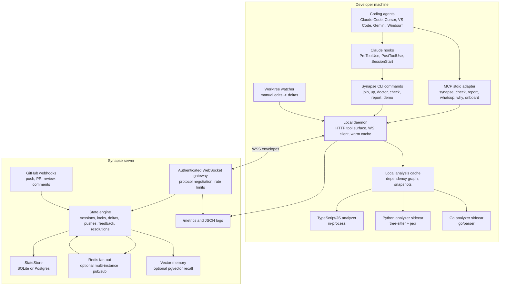

### Current Edit Flow

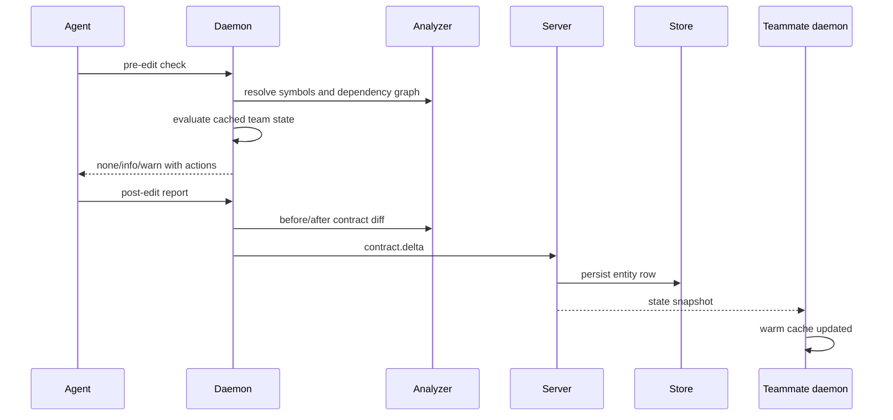

### Main Design Rules

- Raw code stays local. The server receives symbols, signatures, summaries, dependency ids, and prose memories, not file bodies.
- Detection is deterministic. Optional LLM providers can enrich explanations, summaries, or resolutions, but they cannot downgrade deterministic safety.
- The daemon is the local hot path. It keeps team state and dependency analysis warm so pre-edit checks are fast.
- The server is the shared state and fan-out layer. It persists state and broadcasts changes across machines.
- The same conflict engine handles TypeScript/JS, Python, and Go because analyzers emit one language-neutral symbol model.

## Architecture Milestones

These are the points where the shape of the system changed enough to redraw it.

### 8a230fa - Documentation-First Architecture

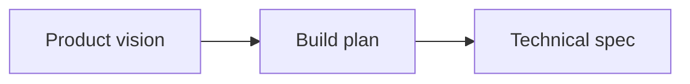

The first commit defined Synapse as a realtime contract-level coordination system before any implementation existed.

### 28777fe - First Realtime Loop

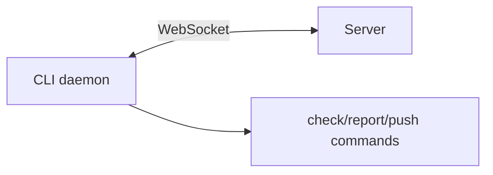

The system became runnable: local CLI processes could talk to a central server and exchange team state.

### 44843eb to 4d9754f - Contract-Aware Detection

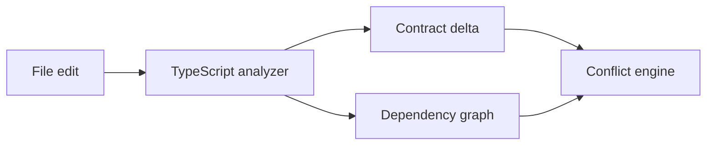

Synapse moved from generic coordination toward its core value: contract-level detection and dependency-aware warnings.

### 9ce9567 to 49e2404 - Stateful Team Memory

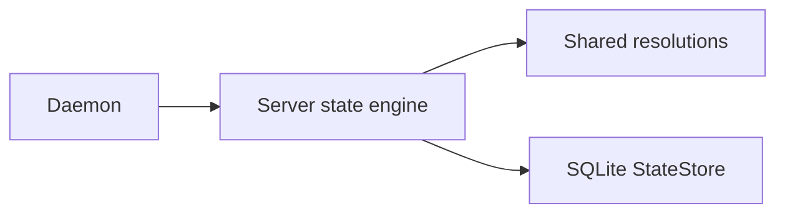

The server stopped being only a transient relay. It began retaining resolutions and team state across restarts.

### aa62095 to a1858d8 - Agent Integration Layer

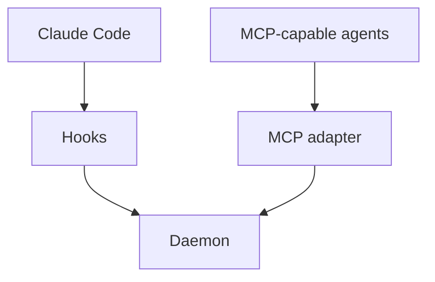

Synapse became usable by real agents without manual CLI calls.

### bbcce57 and 676a28b - Polyglot Analyzer Layer

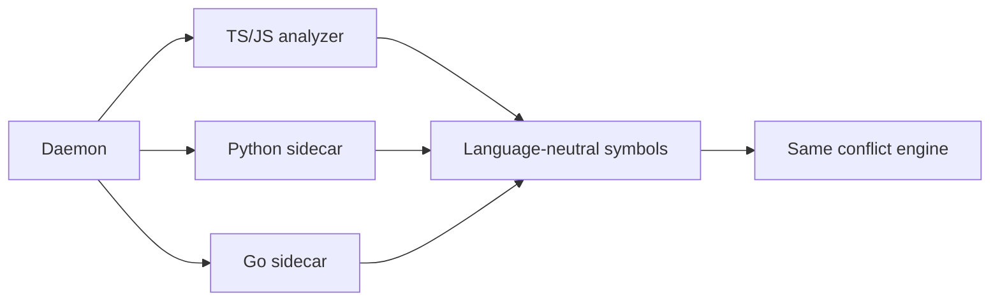

The system generalized from TypeScript-only to a language-neutral contract model.

### 1eeb73d to 496910d - Deployable Multi-Machine Product

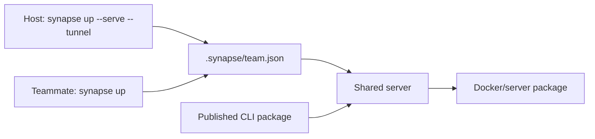

Synapse gained practical setup, diagnostics, Docker hosting, tenancy keys, and a publishable package.

### 0a05819 and 393c492 - Multi-Instance Server

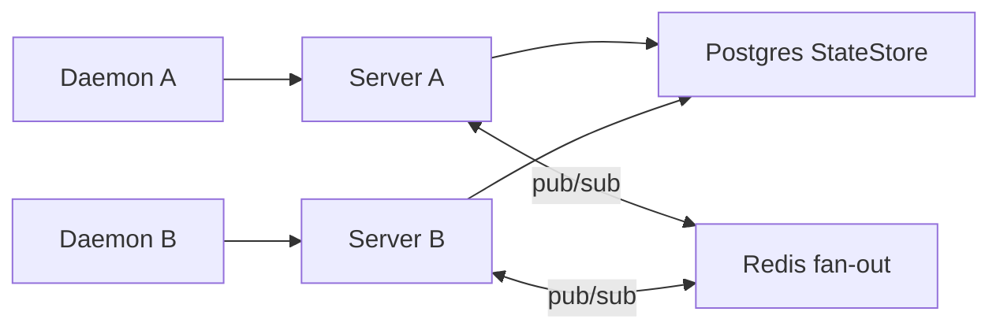

State moved from whole snapshots to per-entity rows, then Redis let multiple server instances stay in sync.

### 184f909 and 844b18b - Memory and Onboarding

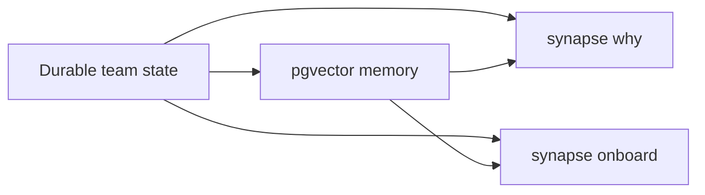

The coordination log became a study and recall layer: why decisions happened, what changed, and what a new session should know.

## Commit-by-Commit Development Notes

### 8a230fa - docs: add synapse project roadmap

Problem: The project needed a shared target before implementation. Solution: added README, build plan, context, and technical spec. System impact: established the core architecture: local daemon, contract extraction, dependency graph, server state, and privacy boundary.

### 4d61392 - chore: scaffold npm workspace tooling

Problem: There was no buildable repo structure. Solution: added npm workspaces, TypeScript base config, package lock, and Turborepo config. System impact: created the monorepo foundation for apps and packages.

### cbf2b18 - feat: add protocol types and conflict engine

Problem: The system needed a common language for sessions, deltas, and conflicts. Solution: added `@synapse/protocol` and `@synapse/conflict-engine` with tests. System impact: separated shared data contracts from conflict evaluation.

### 28777fe - feat: add milestone zero realtime loop

Problem: Synapse was still only types and plans. Solution: added a CLI app, server app, and verification script for the first daemon/server realtime loop. System impact: introduced the daemon-server WebSocket path.

### 744bc0b - Add MIT license

Problem: The repository had no explicit license. Solution: added MIT license. System impact: no runtime change, but clarified reuse terms.

### 44843eb - feat: add TypeScript contract analyzer (#1)

Problem: Conflict detection needed real symbols instead of filenames. Solution: added the TypeScript analyzer package and CLI integration. System impact: Synapse could extract exported TS contracts as structured symbols.

### 4578867 - feat: report TypeScript contract deltas from daemon (#2)

Problem: The daemon could not turn edits into contract changes. Solution: wired TS before/after analysis into daemon reporting. System impact: post-edit reports became contract deltas instead of manual summaries only.

### 643d886 - feat: infer TypeScript symbols for file checks (#3)

Problem: Users should not have to name exact symbols for every check. Solution: inferred relevant TS symbols from a file-level check. System impact: pre-edit checks became usable from hooks and editor integrations.

### 4d9754f - feat: detect TypeScript dependency conflicts (#4)

Problem: Same-symbol overlap misses callers affected by changed contracts. Solution: added TS dependency graph detection and a verifier. System impact: Synapse could warn when a teammate changed a dependency of what you are editing.

### df5caf6 - feat: clear live state on push notify (#5)

Problem: Unpushed deltas should stop warning after the code is pushed. Solution: added push notification handling in CLI/server/protocol. System impact: live conflict state became self-cleaning after pushes.

### 47e4287 - feat: contract compatibility classification + actionable both-sides analysis (#6)

Problem: A signature change is not always breaking, and warnings needed concrete guidance. Solution: added deterministic signature compatibility comparison, richer conflict analysis, optional OpenRouter enrichment, and `contract_divergent`. System impact: the engine began distinguishing breaking, compatible, identical, and unknown changes.

### 9ce9567 - feat: LLM contract resolver - converge two agents on one signature (#7)

Problem: For two incompatible edits to the same symbol, warning alone does not help agents converge. Solution: added resolution types, first-writer-wins canonical resolution storage, deterministic fallback, and optional LLM resolution generation. System impact: conflicts could now carry a proposed shared contract.

### aa62095 - feat: add MCP adapter for daemon tools (#8)

Problem: Non-Claude agents needed a standard way to call Synapse. Solution: added a stdio MCP adapter forwarding tools to the daemon. System impact: the same daemon check/report path became available to MCP-capable agents.

### 094496d - feat: ingest GitHub push webhooks (#9)

Problem: Pushes from GitHub should clear or update team state even when not initiated locally. Solution: added GitHub webhook parsing and verification support. System impact: server state could react to remote repository activity.

### 919bb96 - fix: guard OpenRouter recommendation downgrades

Problem: Optional model output could weaken deterministic safety guidance. Solution: clamped LLM recommendations so they cannot downgrade deterministic verdicts. System impact: preserved the rule that detection and severity remain deterministic.

### a335cba - docs: add OpenRouter manual demo (#11)

Problem: The optional LLM layer needed a reproducible manual test. Solution: documented an OpenRouter demo. System impact: no runtime change; improved validation and onboarding for LLM enrichment.

### ff2c44f - feat: add deterministic whatsup briefing

Problem: Agents needed a quick team-state summary. Solution: added `synapse whatsup`, MCP exposure, protocol response types, and verification. System impact: the daemon cache became readable as a deterministic briefing.

### 5673142 - test: add conflict eval harness

Problem: Conflict quality needed a repeatable check, not only unit tests. Solution: added recorded scenarios and `eval:conflicts`. System impact: introduced evaluation as a quality gate for detection behavior.

### dcea448 - docs: record OpenRouter manual demo results (#14)

Problem: The manual LLM demo needed recorded outcomes. Solution: updated the demo document with results. System impact: documentation-only evidence of optional LLM behavior.

### 31ae2bd - feat: use joined config as CLI defaults (#15)

Problem: Commands required repeated flags after `join`. Solution: read `.synapse/config.json` as defaults after flags and environment variables. System impact: local commands became tied to the joined repo room automatically.

### bbcce57 - feat: Python analyzer sidecar (#16)

Problem: Synapse only understood TypeScript. Solution: added a Python sidecar using tree-sitter and jedi over JSON-RPC/stdio, with graceful fallback. System impact: Python contracts entered the same symbol model and conflict engine.

### 49e2404 - feat: durable server state via SQLite StateStore (#17)

Problem: Server restarts lost sessions, deltas, pushes, locks, and resolutions. Solution: added a storage-agnostic `StateStore` and SQLite-backed snapshots. System impact: team state survived process restarts.

### a1858d8 - feat: install and serve Claude Code hooks (#18)

Problem: Synapse only worked when an agent manually called it. Solution: `synapse join` installed Claude Code PreToolUse/PostToolUse hooks and added `synapse hook`. System impact: checks and reports became automatic around edits.

### e534073 - feat: session-end summaries (Layer II) (#19)

Problem: When a session ended, its work disappeared from the active view. Solution: created session summaries from deltas and optional LLM prose. System impact: completed sessions became durable briefing material.

### 324cd78 - feat: session-start catch-up briefing (Layer II) (#20)

Problem: Returning agents lacked context about what changed while away. Solution: added SessionStart hook behavior that injects a `whatsup` briefing. System impact: sessions now begin with team context.

### f8e7e49 - feat: optional shared-token auth (#21)

Problem: Any client could join and mutate a repo room. Solution: added optional token auth for WSS and `/state`, with constant-time comparison. System impact: local/dev stayed open by default, while shared deployments gained basic protection.

### 64ef03f - docs: reconcile build plan and technical spec (#22)

Problem: Planning docs were stale after the first wave of implementation. Solution: updated status tables, wire protocol notes, and open decisions. System impact: documentation matched the implemented system.

### aefd22c - feat: ingest GitHub repo activity into briefings (#23)

Problem: Briefings missed PR and repository events. Solution: expanded GitHub webhook ingestion into repo activity records surfaced in state and briefings. System impact: `whatsup` and memory gained repository context beyond live deltas.

### 665685b - feat: benchmark hot-path check latency (#24)

Problem: The pre-edit path must stay fast, but there was no benchmark. Solution: added a hot-path latency verifier. System impact: performance became an explicit contract for checks.

### b6a442e - test: benchmark large-repo check latency (#25)

Problem: Small fixtures do not prove the design scales. Solution: added large-repo latency verification. System impact: guarded against analyzer or graph changes making checks too slow.

### 924ef92 - feat: add deterministic synapse why (#26)

Problem: Users needed to ask why a decision or warning existed. Solution: added deterministic `synapse why` over team state and MCP. System impact: durable state became searchable explanation material.

### 1c349ce - test: benchmark tracked repo check latency (#27)

Problem: Synthetic benchmarks were not enough. Solution: added tracked-repo latency verification. System impact: expanded performance confidence on realistic repository state.

### 9925797 - feat: record conflict feedback telemetry (#28)

Problem: The system could not learn which warnings users dismissed or acted on. Solution: added feedback capture through CLI/MCP/server/store and adaptive severity inputs. System impact: warning quality became measurable.

### 10e51d1 - feat: include feedback in memory search (#29)

Problem: `why` omitted user feedback history. Solution: included feedback records in search sources. System impact: explanations could cite how the team responded to previous warnings.

### 1eeb73d - feat: seamless multi-machine setup (#30)

Problem: Two machines often failed to coordinate because repo IDs, server URLs, or tokens did not line up. Solution: derived repo identity from git remotes, added `.synapse/team.json`, `synapse up`, and `synapse doctor`. System impact: setup became a guided multi-machine workflow with diagnostics.

### 7e7921a - fix(up): print a runnable teammate command

Problem: `synapse up --tunnel` printed an unpublished package command. Solution: changed output to runnable installed/source-checkout commands and verified it. System impact: teammate onboarding instructions became executable.

### e353296 - Ship server via Docker with per-project key auth and tenancy (#31)

Problem: A shared server needed deployment packaging and repo-scoped credentials. Solution: added Docker assets, `docker-compose.yml`, project key derivation, and tenancy verification. System impact: Synapse became deployable beyond a local process.

### b4fc5c4 - Foundation hardening (#32)

Problem: The system needed production basics: CI, reconnects, observability, validation, adaptive severity, and package checks. Solution: added CI workflow, resilient WS outbox/reconnect, metrics/logging, zod wire schemas, ingress caps, adaptive severity, and npm pack verification. System impact: transformed the prototype into a hardened foundation.

### 70f6668 - docs: rewrite README in scannable structure (#33)

Problem: The README had grown into long prose. Solution: reorganized it into features, commands, reliability, auth, and verification sections. System impact: documentation became easier to navigate without behavior changes.

### 496910d - feat: ship the CLI as a single publishable npm package (#34)

Problem: Users needed one public package instead of private workspace packages. Solution: bundled internal workspaces into `@kumario/synapse`, added packaging scripts, and verified installed-mode behavior. System impact: the CLI became distributable as a single npm package.

### 55b7ece - feat(connect): seamless MCP onboarding (#35)

Problem: Non-Claude agents lacked automatic setup and usage guidance. Solution: added `synapse connect` to register MCP servers and write rules/instructions for Cursor, VS Code, Gemini, Windsurf, and generic MCP clients. System impact: hook-equivalent behavior expanded beyond Claude Code.

### 63ca1ef - docs: add hands-on two-agent demo

Problem: Users needed a reliable way to see a conflict happen. Solution: added a two-agent demo and common gotchas to README. System impact: documentation-only, but it clarified real usage order and failure modes.

### c374409 - Merge pull request #36

Problem: The demo documentation branch needed integration into main. Solution: merged the two-agent demo docs. System impact: no additional code change beyond integrating the documentation.

### 9542d46 - feat(conflicts): branch-aware severity (#37)

Problem: Cross-branch stale-base and dependency warnings were too loud because they matter later at merge time. Solution: sessions and pushes carry branch data; the engine demotes selected cross-branch warnings to `info`. System impact: severity became aware of branch context.

### 73274ac - refactor(cli): decompose index.ts (#38)

Problem: `apps/cli/src/index.ts` had become too large to maintain. Solution: moved daemon, config, analysis, hooks, briefings, HTTP, tunnel, and commands into focused modules. System impact: no behavior change, but the CLI architecture became understandable and extensible.

### 0a05819 - feat(store): per-entity StateStore with SQLite + Postgres (#39)

Problem: Whole-state snapshot writes were inefficient and unsafe for multi-instance servers. Solution: replaced snapshot persistence with per-entity store operations and added a Postgres backend. System impact: state persistence became incremental and ready for shared deployment.

### 393c492 - feat(server): Redis fan-out for multi-instance deployments (#40)

Problem: Multiple server instances needed to see each other's mutations. Solution: added optional Redis pub/sub invalidation and reload from shared Postgres, with per-repo locking. System impact: Synapse could run as a multi-instance service.

### 548aca2 - feat(daemon): worktree file watcher (#41)

Problem: Manual editor saves and generated files were invisible unless an agent reported them. Solution: added a chokidar watcher that routes analyzable changes through the same report path. System impact: live state now reflects non-agent edits too.

### f680106 - feat(analyzer-ts): close JS/JSX/TSX gaps (#42)

Problem: Common JS/TS patterns like default exports, TSX components, and `.mjs` imports were missed. Solution: improved extraction and dependency resolution for default exports/imports and `.mjs`. System impact: frontend and mixed JS/TS repos got better contract coverage.

### 676a28b - feat(analyzer-go): Go contract analyzer sidecar (#43)

Problem: Go repos fell back to coarse file-level detection. Solution: added a Go sidecar using `go/parser` and `go/ast`, with the same JSON-RPC style as Python. System impact: Go contracts joined the language-neutral conflict engine.

### 4b063c7 - feat(protocol): version negotiation at WS handshake (#44)

Problem: Future wire changes would fail opaquely if client/server versions differed. Solution: added protocol version negotiation, HTTP 426 refusal, health metadata, and doctor checks. System impact: upgrades became explicit and diagnosable.

### b4d215c - feat(server): rate limiting + webhook posture (#45)

Problem: Production ingress needed abuse controls and signed webhooks. Solution: added WS and webhook rate limits, metrics, and a requirement for GitHub webhook secrets in auth-enabled deployments. System impact: internet-facing deployments became safer.

### adda97c - test: analyzer fuzzing + resolution hash properties (#46)

Problem: Analyzer crashes and non-stable resolution hashes could break coordination. Solution: added malformed-source fuzzing and property tests for `resolutionInputsHash`. System impact: robustness guarantees improved without changing the product surface.

### 184f909 - feat(rag): vector memory + hybrid why recall (#47)

Problem: Lexical search missed semantically related decisions. Solution: added optional embeddings, pgvector memory, `/recall`, and hybrid `why` results. System impact: memory became semantic when configured, while deterministic fallback remained.

### 3a0b685 - docs(plan): mark roadmap complete (#48)

Problem: The roadmap status no longer reflected completed milestones. Solution: updated the status ledger. System impact: documentation-only, clarifying which roadmap items remained decision-gated.

### ae1b71c - fix(daemon): seed report snapshots during checks (#49)

Problem: Post-edit reporting could lack a baseline when the first contact was a check. Solution: seeded report snapshots during checks. System impact: first post-edit reports could produce accurate before/after deltas.

### 4c42d30 - fix(server): release advisory locks on init failure

Problem: Failed Postgres initialization could leave advisory locks held too long. Solution: extracted advisory-lock handling and ensured locks release on failure. System impact: improved Postgres startup reliability.

### d752deb - Merge pull request #50

Problem: The advisory-lock fix branch needed integration. Solution: merged the fix into main. System impact: no extra behavior beyond the integrated server reliability fix.

### 8c46a61 - fix(analyzer-ts): resolve namespace import edges

Problem: Namespace imports like `import * as X` missed dependency edges. Solution: updated the TS analyzer graph resolution and tests. System impact: dependency conflict detection became more accurate for namespace import style.

### 84a800a - Merge pull request #51

Problem: The namespace-import fix branch needed integration. Solution: merged it into main. System impact: no extra behavior beyond the analyzer fix.

### 9159dbb - fix(daemon): bound local JSON and validate server frames

Problem: Local JSON inputs and server frames were too trusting. Solution: bounded local JSON body reads and validated server messages with wire schemas. System impact: daemon inputs became safer and malformed server frames no longer mutated local state.

### 776a717 - Merge pull request #52

Problem: The daemon input-hardening branch needed integration. Solution: merged it into main. System impact: no extra behavior beyond the hardening fix.

### 09fcb70 - docs(plans): direction plans 009-016

Problem: Several next-step ideas needed precise implementation plans and review. Solution: added and revised planning documents for delta broadcast, npm front door, onboarding, rename tracking, PR memory, demo, detection benchmark, and command-grounded LLM actions. System impact: planning-only; it set up later feature slices.

### 793c581 - docs(release): point installs at @kumario/synapse

Problem: Docs still pointed at an unpublished workspace package and old release status. Solution: updated install docs and release config toward `@kumario/synapse` 0.2.0. System impact: release instructions matched the real package name.

### 0ade4a8 - Merge pull request #53

Problem: The npm front-door release-doc branch needed integration. Solution: merged it into main. System impact: documentation/release metadata integration only.

### 9d32476 - feat(protocol): refresh session branch on heartbeat

Problem: Branch-aware severity used stale branch data after a checkout. Solution: heartbeats now carry current branch and the server updates the session branch. System impact: branch-aware warnings stay correct during long sessions.

### 368f854 - perf(daemon): reuse warm dependency graph until source changes

Problem: Pre-edit checks rebuilt or re-fingerprinted graphs even when nothing changed. Solution: tracked graph dirty/trusted state and reused the warm graph after watcher readiness. System impact: hot-path checks became faster on stable worktrees.

### 65bc8a3 - Merge pull request #54

Problem: The live branch update branch needed integration. Solution: merged branch refresh on heartbeat. System impact: no extra behavior beyond the protocol feature.

### 90597b9 - docs(design): incremental state.delta broadcast

Problem: Full snapshots are heavier than needed, but changing the wire format requires design. Solution: documented a protocol-v2 `state.delta` plan using per-entity operations and sequence numbers. System impact: design-only; current server still sends snapshots.

### 41cfc46 - Merge pull request #55

Problem: The warm check cache branch needed integration. Solution: merged graph reuse optimization. System impact: no extra behavior beyond the performance improvement.

### de71e3c - Merge pull request #56

Problem: The state-delta design branch needed integration. Solution: merged the design document. System impact: documentation-only.

### 844b18b - feat(cli): synapse onboard (#57 slice)

Problem: A new member has no prior session baseline, so session-start catch-up is not enough. Solution: added `synapse onboard`, daemon/MCP tool support, cited decision history, and optional RAG enrichment. System impact: first-session onboarding became an explicit product flow.

### ec63ba6 - test: expect synapse_onboard in MCP tool-list verifies

Problem: Verification scripts missed the newly added MCP tool. Solution: updated MCP/connect verify expectations. System impact: prevented regressions in the exposed tool surface.

### 8c7b204 - feat(analyzer-ts): detect unambiguous same-file renames

Problem: A rename looked like remove plus add, losing the link to the new name. Solution: paired unique same-file removed/added symbols with identical name-independent shape into `renamed` deltas. System impact: dependents get better guidance for TS symbol renames.

### 6e756c5 - Merge pull request #57

Problem: The onboard briefing branch needed integration. Solution: merged `synapse onboard`. System impact: no extra behavior beyond the onboarding feature.

### 6e41454 - feat(server): distill PR-thread prose into repo events + memory

Problem: GitHub comment/review bodies explaining decisions were discarded. Solution: added deterministic prose distillation that strips code/URLs and stores safe details for memory indexing. System impact: `why` and onboarding can cite PR decision rationale.

### 42098de - Merge pull request #58

Problem: The rename tracking branch needed integration. Solution: merged TS rename tracking. System impact: no extra behavior beyond the analyzer feature.

### d7de3f6 - Merge branch main into advisor/013-pr-decision-memory

Problem: The PR decision memory branch needed to catch up with main before merge. Solution: merged main into the branch. System impact: integration bookkeeping, no standalone feature.

### 23dfc56 - Merge pull request #59

Problem: The PR decision memory branch needed integration. Solution: merged GitHub prose distillation. System impact: no extra behavior beyond the memory ingestion feature.

### ba91099 - feat(cli): synapse demo - one-command sandboxed conflict demo

Problem: The two-agent demo required manual orchestration. Solution: added `synapse demo` to spin up a sandbox server and two daemons, create a conflict, narrate it, and clean up. System impact: users can test the full loop with one command.

### dac701f - Merge pull request #60

Problem: The demo command branch needed integration. Solution: merged `synapse demo`. System impact: no extra behavior beyond the demo command.

### 6e74904 - feat(llm): ground conflict-analysis actions in command catalog

Problem: LLM-suggested actions could refer to nonexistent or vague tools. Solution: added a protocol command catalog, prompt grounding, command allowlist validation, and deterministic command suggestions. System impact: conflict analysis actions now map to real Synapse commands/tools.

### c475754 - Merge pull request #61

Problem: The command-grounded LLM branch needed integration. Solution: merged the command catalog work. System impact: no extra behavior beyond the LLM action grounding.

### 5f2948a - test(evals): detection-quality benchmark

Problem: Detection needed precision/recall tracking by rule, not just pass/fail examples. Solution: added a 25-scenario detection corpus, ratchet baseline, and CI integration. System impact: detection quality became measurable and protected.

### 71e8984 - Merge pull request #62

Problem: The detection benchmark branch needed integration. Solution: merged the eval corpus and ratchet. System impact: no extra behavior beyond the test/eval gate.

### 88a1107 - docs(plan): refresh implemented feature status

Problem: Docs still described implemented features as future or partial. Solution: updated README, build plan, context, and technical spec for Postgres, Redis, pgvector, adaptive severity, and Go analyzer. System impact: docs now match current implementation.

### 7832c95 - Merge pull request #63

Problem: The docs refresh branch needed integration. Solution: merged roadmap/status updates. System impact: documentation integration only.

### e008582 - test: extract shared verify harness helpers

Problem: Verify scripts duplicated process and HTTP helper logic. Solution: moved common helpers into `scripts/lib/verify-harness.mjs`. System impact: verification code became easier to maintain without changing product behavior.

### 8c0d788 - Merge pull request #64

Problem: The verify harness refactor needed integration. Solution: merged shared verify helpers. System impact: no runtime change; testing infrastructure is cleaner.

## How To Study The Code From Here

1. Start with `packages/protocol/src/index.ts` to learn the data model.
2. Read `packages/conflict-engine/src/index.ts`, `compare.ts`, `branch-aware.ts`, and `adaptive.ts` to understand verdicts.
3. Read `apps/cli/src/daemon.ts` for the local runtime loop.
4. Read `apps/cli/src/analysis.ts` and the analyzer packages to understand symbol extraction.
5. Read `apps/server/src/state.ts`, `store.ts`, `store-pg.ts`, and `index.ts` for server state, persistence, auth, fan-out, and memory.
6. Use `scripts/verify-*.mjs` as executable examples of how each feature is expected to behave.
